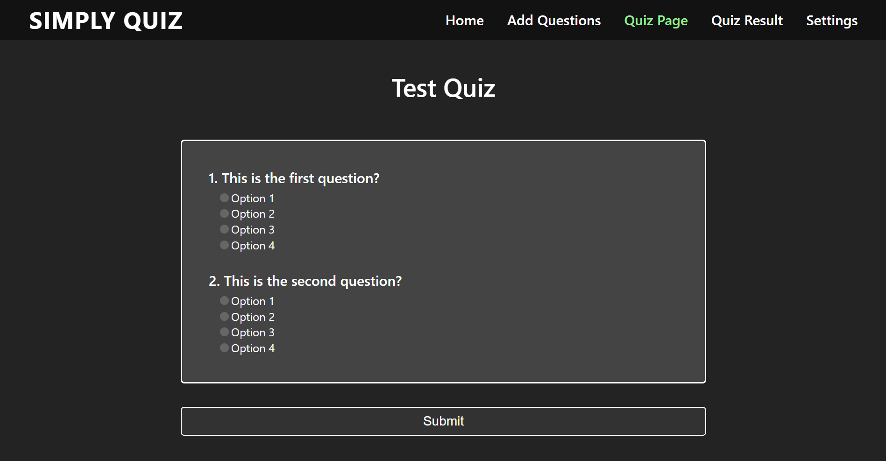

# [Quiz App](https://naimur29-quizapp.netlify.app/)

> This is my Online Quiz Aplication project. Just for fun!

---

### Header:

- [Description](#description)
- [How To Use](#how-to-use)

---

## Description

You can take fun quizes with your friends😁!!  
Dev Goal: Learn React Router Dom...

### Packages:  
1.Used React JS Framework.  
2.React Router for client site navigation.
 
3.NPM as package manager
4.Vanilla JavaScript Language.
 
5.HTML & Vanilla CSS.

### Some features of my project:  
1.This site is responsive for mobile and Desktop.  
2.It automatically switches to light or dark mode depending on your system preferences.  
3.Have a settings section & have plans for adding backend. 

---

## How To Use

If you want download this project you can download zip file or clone this site.
After download you open the project in your IDE and open your terminal. Then for running this project you type in your terminal "npm start".

---

## Live link:
- [Click to visit Quiz App](https://naimur29-quizapp.netlify.app/)
